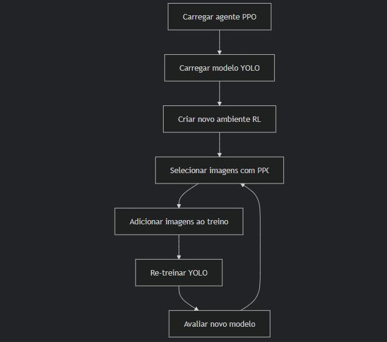

# DALRL-YOLOV11 (Deep Active Learning with Reinforcement Learning in YOLOV11)

### Novel pipeline for training with few labeled data samples based in average entropy/confiances of bounding boxes.

Step 1 - Train yolo with small set.

Step 2 - Train learning agent by reinforcement with selection pool data.

Step 3 - Select the images based on medium entropy and average bounding box confidence.

Step 4 - Re-training the Yolov11 model

Step 5 - Evaluate new Yolov11 model

Step 5 - Re-training the reinforcement learning agent.

