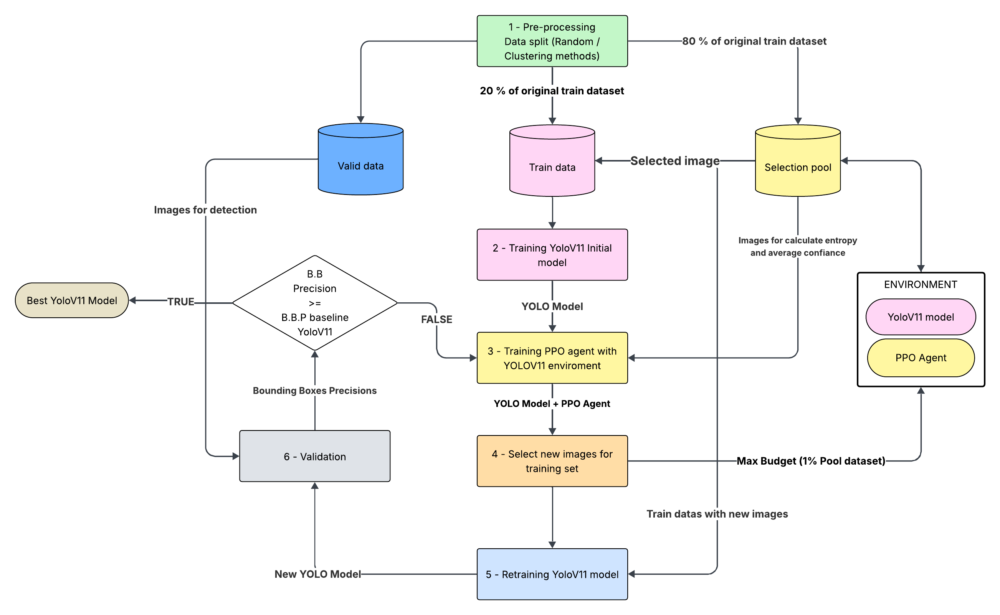

# DALRL-YOLOV11 (Deep Active Learning with Reinforcement Learning in YOLOV11)

### Novel pipeline for training with few labeled data samples based in average entropy/confiances of bounding boxes.

The approach begins by separating the COCO training dataset into two parts. The first for actually training the Yolo models, and the other, called the Pool, for selecting new images for the training set. In addition, the COCO validation set is used.

Separation takes place in two ways. The first is through random selection and the second is through clustering. For the random approach, 20% of the total training data is chosen. For the clustering approach, the K-Means algorithm is used (it could be any other algorithm that uses distances in a 2-D space) to group embeddings generated by a classic resnet-18  (https://arxiv.org/abs/1512.03385), applied to the images in the set. In the end, 80 clusters are created (from each COCO class) and the center of the cluster and 20% of the edge samples (which are on the borders of the cluster with neighboring clusters) are chosen for training.

With the data separated, an initial YoloV11 (Ultralytics version (https://arxiv.org/abs/2410.17725)) model is trained (one model for each training selection strategy).  This initial model is used to train a PPO (Proximal policy optimization (https://arxiv.org/abs/1707.06347)) reinforcement learning agent, which, together with the Yolo model, forms the environment. The agent is trained with the data in the Pool set, and uses the average entropy and average confidence of the bounding boxes of the Yolo model detections to take image selection actions, which are included in the reward/penalty functions.

With the agents created, the selection stage is carried out on the Pool set, with the limitation of selecting 1% of the images. These images are then moved to the training set. In the next step, a new YoloV11 model is trained and validated on the validation set. If the model outperforms the reference model from the original YoloV11 paper on COCO in the bounding box accuracy metric in the training stage, it is chosen as the best model. If not, the agent is retrained and the cycle starts again.

The aim of the project is to try to achieve an precision of the detected bounding boxes equal to or better than the reference model, using less training data.

Librarys used: 
    - [Stable_baselines3](https://stable-baselines3.readthedocs.io/en/master/)
    - [PyTorch](https://pytorch.org)
    - [Ultralytics](https://github.com/ultralytics/ultralytics)
    - [Gymnasium](https://gymnasium.farama.org/index.html)
    - [Sklearn](https://stable-baselines3.readthedocs.io/en/master/)

## Speed Start

- Executar a preparação de dados (**Files**: PrepareDatas-EmbeddingClustering.ipynb and PrepareDatas-Random.ipynb)
    - Note: Está setado para o COCO dataset 2017. Avalie e modifique caso necessário para seu dataset.

- Executar o treino inicial dos modelos YoloV11 com cada conjunto iniciais. (**File**: beforeCicle.py)

- Iniciar o ciclo (ajustar o número de ciclos. Default: 10). (**File**: cicle.py)
